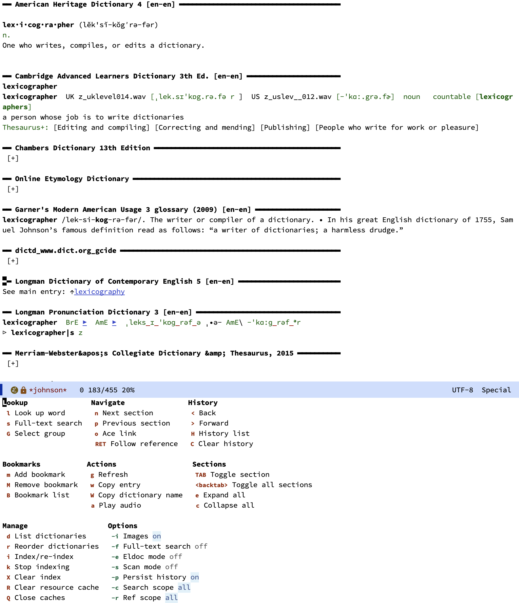

# `johnson`: A multi-format dictionary UI for Emacs


## Overview

`johnson` brings the functionality of desktop dictionary programs like GoldenDict and StarDict into Emacs. You point it at your dictionary files, index them once, and then look up words across all your dictionaries simultaneously with dynamic completion. Results appear in a dedicated buffer with collapsible sections, one per dictionary, rendered with full formatting.

The package is implemented entirely in Emacs Lisp with no external dependencies. It relies on Emacs 30.1's built-in sqlite support for efficient headword indexing and parses all dictionary formats natively.

Supported formats:

- **DSL** (ABBYY Lingvo) — including dictzip-compressed `.dsl.dz` files and abbreviation tables
- **StarDict** — `.ifo`/`.idx`/`.dict` with dictzip support and synonym files
- **MDict** — `.mdx`/`.mdd` with HTML+CSS rendering and encrypted dictionary support
- **BGL** (Babylon) — `.bgl` files with automatic format detection
- **EPWING** (JIS X 4081) — Japanese electronic dictionaries with EBZIP decompression support
- **DICT protocol** (RFC 2229) — for querying remote dictionary servers

The architecture is modular: each format is handled by a separate backend that registers itself with the core via a plist-based format registry. You can use only the formats you need.

Beyond basic lookups, `johnson` provides wildcard search (`?` and `*`), full-text search within definitions, eldoc integration, a scan-popup mode that shows definitions on selection or idle, bookmarking, persistent history, inline images, and a completion-at-point backend.



## Installation

Requires Emacs 30.1 or later.

### package-vc (built-in since Emacs 30)

```emacs-lisp
(use-package johnson
  :vc (:url "https://github.com/benthamite/johnson"))
```

### Elpaca

```emacs-lisp
(use-package johnson
  :ensure (:host github :repo "benthamite/johnson"))
```

### straight.el

```emacs-lisp
(use-package johnson
  :straight (:host github :repo "benthamite/johnson"))
```

## Quick start

```emacs-lisp
(use-package johnson
  :vc (:url "https://github.com/benthamite/johnson")
  :custom
  (johnson-dictionary-directories '("~/dictionaries/"))
  :bind
  ("C-c d" . johnson-lookup)
  ("C-c j" . johnson-menu))
```

1. Set `johnson-dictionary-directories` to where your dictionary files live.
2. Run `M-x johnson-index` to scan and index all discovered dictionaries.
3. Run `M-x johnson-lookup` (or `C-c d` with the config above) to look up a word.
4. Run `M-x johnson-menu` (or `C-c j` with the config above) to explore the other commands and user options.

Results appear in a `*johnson*` buffer. Press `n`/`p` to move between dictionary sections, `TAB` to collapse or expand a section, `RET` to follow cross-references, and `l`/`r` to navigate back and forward through lookup history.

## Documentation

For a comprehensive description of all user options, commands, and functions, see the [manual](https://stafforini.com/notes/johnson/).

## Roadmap

- [x] **v0.1** — DSL format: encoding detection, headword alternation, full markup rendering, cross-reference navigation, dictionary groups, completion-at-point
- [x] **v0.2** — StarDict format, dictzip compression, audio pronunciation, table of contents, dictionary priority reordering
- [x] **v0.3** — MDict format (including encrypted dictionaries), DSL abbreviation tables
- [x] **v0.4** — BGL format, DICT protocol client, inline images, wildcard search, full-text search, eldoc, scan-popup mode, bookmarks, history buffer
- [x] **v0.5** — EPWING format (JIS X 4081), EBZIP decompression, fullwidth-to-ASCII normalization, cross-reference navigation
